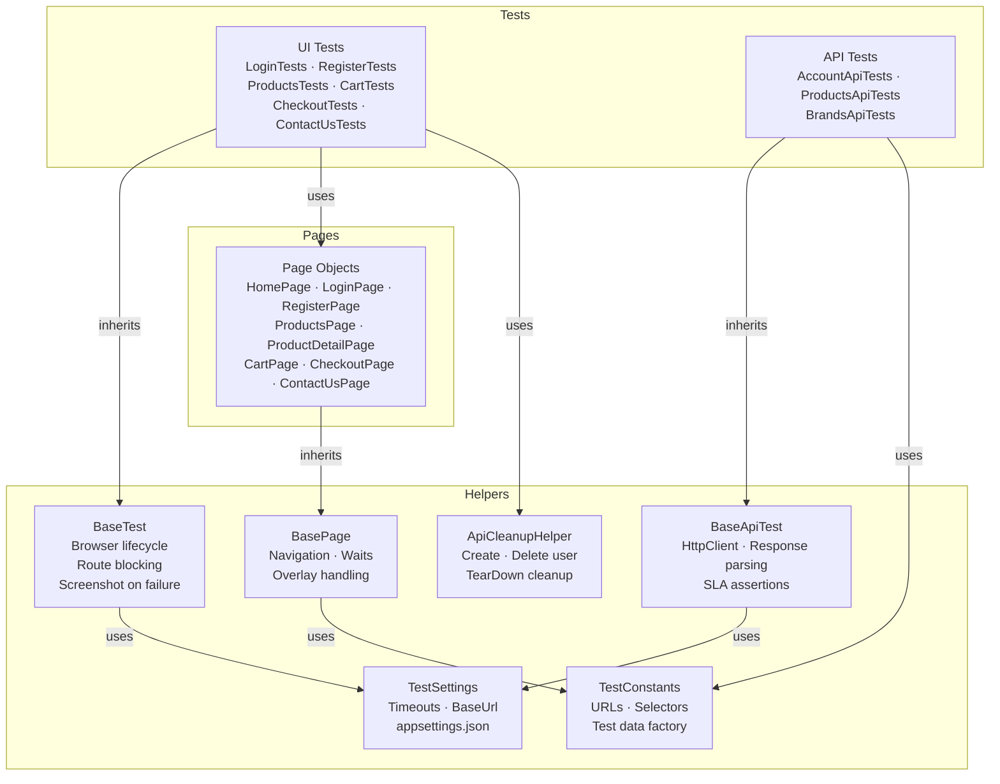

# AutomationExercise.Playwright

[](https://github.com/QA-yanakin/AutomationExercise.Playwright/actions/workflows/e2e-tests.yml)
[](https://dotnet.microsoft.com/download)
[](https://playwright.dev)
[](https://nunit.org)
[]()

End-to-end test automation suite for [automationexercise.com](https://automationexercise.com) built with C# / .NET 8, Microsoft Playwright, and NUnit 3.

---

## Tech Stack

| Tool | Version | Purpose |
|------|---------|---------|
| .NET | 8.0 | Runtime |
| Microsoft Playwright | 1.58 | Browser automation |
| NUnit | 4.2 | Test runner |
| FluentAssertions | 6.12 | Readable assertions |
| Bogus | 35.6 | Test data generation |

---

## Project Structure

```
AutomationExercise.Tests/
├── Helpers/
│   ├── BasePage.cs          # Abstract base for all Page Objects
│   ├── BaseTest.cs          # Browser lifecycle, route blocking, screenshot on failure
│   ├── BaseApiTest.cs       # HTTP client, API response parsing, SLA assertions
│   ├── ApiCleanupHelper.cs  # Shared HTTP client for test data setup/teardown
│   ├── TestConstants.cs     # URLs, selectors, expected messages, test data factory
│   └── TestSettings.cs      # Config loading from appsettings.json
├── Pages/                   # Page Object Model classes
│   ├── HomePage.cs
│   ├── LoginPage.cs
│   ├── RegisterPage.cs
│   ├── ProductsPage.cs
│   ├── ProductDetailPage.cs
│   ├── CartPage.cs
│   ├── CheckoutPage.cs
│   └── ContactUsPage.cs
├── Tests/
│   ├── UI/                  # Browser-based tests (inherit BaseTest)
│   └── API/                 # HTTP contract tests (inherit BaseApiTest)
├── appsettings.json         # Base configuration
├── appsettings.local.json   # Local overrides with credentials (gitignored)
├── nunit.runsettings        # Parallel execution and retry configuration
└── playwright.json          # Playwright browser settings
```

---

## Setup

### Prerequisites
- [.NET 8 SDK](https://dotnet.microsoft.com/download)
- PowerShell (Windows) or `pwsh` (macOS/Linux)

### 1. Clone and restore packages

```bash
git clone https://github.com/QA-yanakin/AutomationExercise.Playwright.git
cd AutomationExercise.Playwright/AutomationExercise.Tests
dotnet restore
```

### 2. Install Playwright browsers

```powershell
powershell -ExecutionPolicy Bypass -File "bin/Debug/net8.0/playwright.ps1" install chromium
```

### 3. Configure credentials

Copy the template and fill in your credentials:

```bash
cp appsettings.local.template.json appsettings.local.json
```

Edit `appsettings.local.json`:
```json
{
  "TestUser": {
    "Email": "your-test-email@example.com",
    "Password": "your-test-password"
  },
  "Browser": {
    "Headless": false,
    "SlowMo": 500
  }
}
```

> `appsettings.local.json` is gitignored and never committed.

---

## Running Tests

```bash
# All tests
dotnet test

# Smoke gate only (fast, run first)
dotnet test --filter "Category=Smoke"

# UI tests only
dotnet test --filter "Category=UI"

# API tests only (no browser required)
dotnet test --filter "Category=API"

# Negative tests only
dotnet test --filter "Category=Negative"
```

---

## Test Coverage

**38 tests — ~2.5 min runtime in CI (parallel execution)**

| Area | Tests | What is covered |
|------|:-----:|-----------------|
| UI — Home & Smoke | 2 | Page load, newsletter subscribe |
| UI — Login & Auth | 5 | Valid login, invalid credentials, logout, session persistence |
| UI — Registration | 3 | Full form, duplicate email (negative), field validation |
| UI — Products | 5 | Listing, product detail, search, category filter, brand filter |
| UI — Cart & Checkout | 4 | Add to cart, remove from cart, quantity, guest redirect |
| UI — Contact Us | 1 | Form submit with JS dialog handling |
| API — Products | 4 | GET list, GET search, POST search (negative 400), schema validation |
| API — Brands | 2 | GET list (contract), PUT (negative 405) |
| API — Account | 12 | Create, login, get by email, delete — happy path + negative cases |
| **Total** | **38** | **0 failed · 0 skipped** |

---

## Architecture Decisions



### Page Object Model
All UI interactions are encapsulated in Page Objects (`/Pages`). Test classes contain only assertions — no raw Playwright calls, no selectors.

### Selector Strategy (priority order)
1. `data-qa` attributes
2. ARIA roles — `GetByRole()`
3. Label text — `GetByLabel()`
4. Placeholder — `GetByPlaceholder()`
5. `#id` or `[name="..."]`
6. Visible text — `GetByText()`
7. Relative XPath — last resort

CSS class selectors are avoided; exceptions are documented inline.

### Test Data Strategy
- UI tests use **API state injection** for prerequisites (login, user creation) — never the UI
- Every test that creates a user account deletes it in `[TearDown]`
- Unique emails generated per run using `Guid`: `user_{guid}@example.com`
- Stable reference data (product IDs, category names) defined in `TestConstants`

### Performance
- **Route interception** blocks ad/tracking scripts (reduces page load from ~6s to ~1-2s)
- **DOMContentLoaded** instead of NetworkIdle for navigation waits
- **Parallel execution** via `nunit.runsettings` (4 workers)
- Three-tier timeout: `ElementTimeout` (10s) / `NavigationTimeout` (15s) / `DefaultTimeout` (30s)

### Failure Diagnostics
- Screenshot on failure — saved to `/TestResults/Screenshots/`
- API last-response logged on failure with status, timing, and body
- `WaitForVisibleAsync` includes page name and URL in timeout messages

---

## CI/CD Notes

For pipeline execution, add these steps before running tests:

```bash
dotnet restore
dotnet build
pwsh -File "bin/Debug/net8.0/playwright.ps1" install chromium
dotnet test --filter "Category=Smoke"   # gate
dotnet test                              # full suite
```

Set `BASE_URL` environment variable to target staging vs production.

---

## Branch Structure

| Branch | Contents |
|--------|----------|
| `main` | Current framework (v2) |
| `v1-basic` | Original basic POM implementation |
